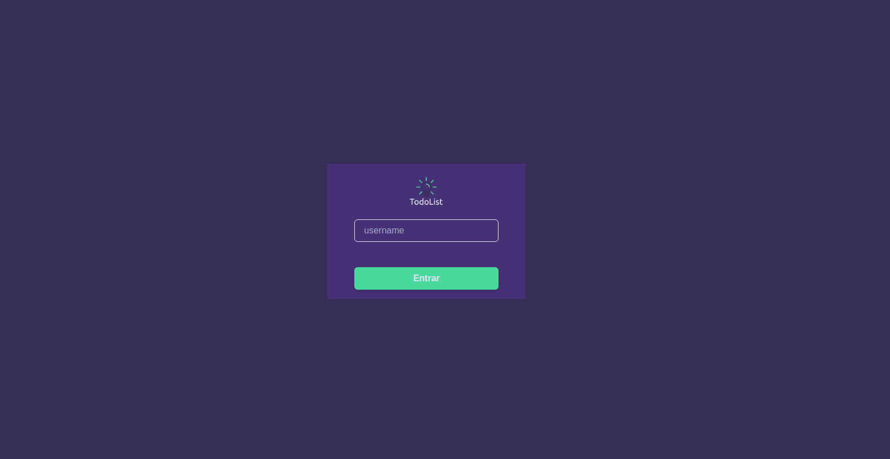
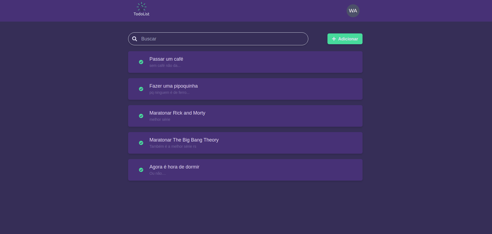
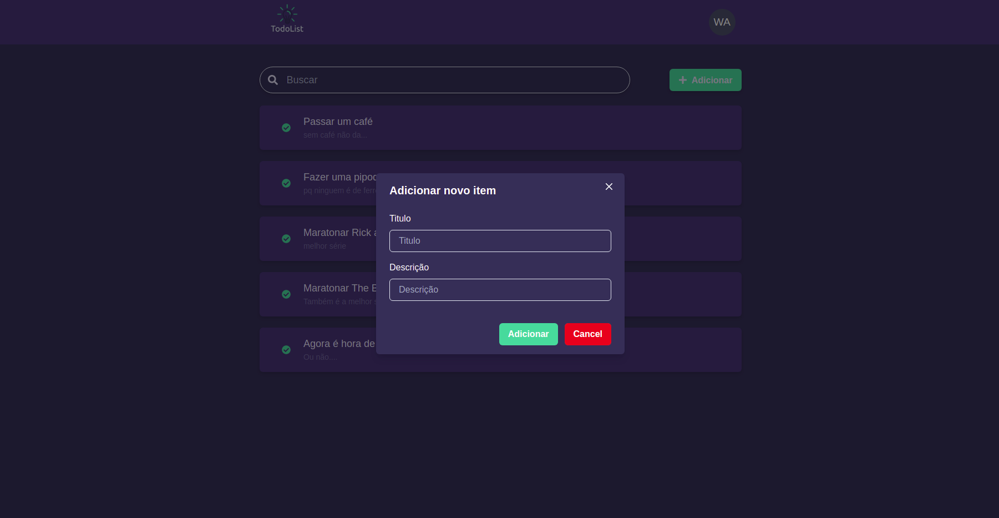
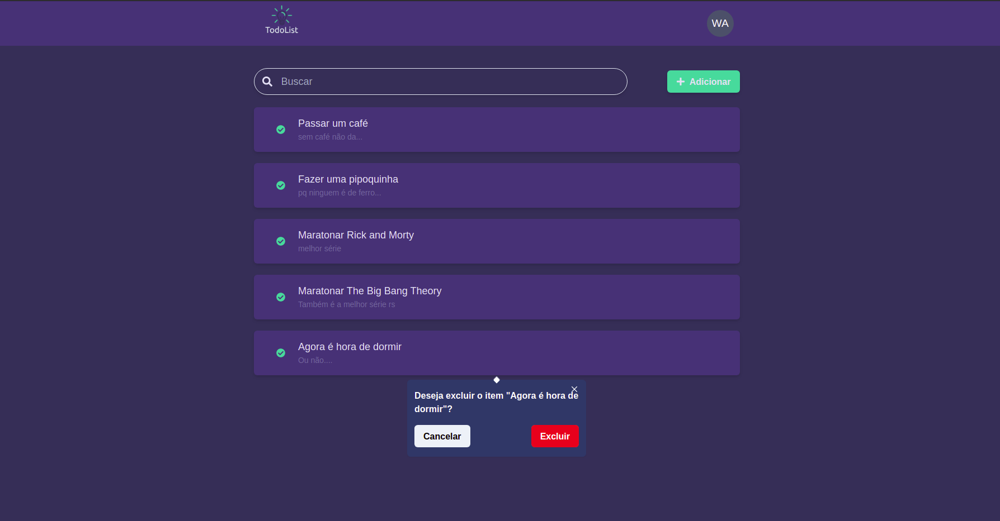

<h1 align="center">Welcome to TodoList 👋</h1>
<p>
  
  <a href="https://mit-license.org/" target="_blank">
    
  </a>
</p>

> To do list

<br/>

### ✨ Demo

<br/>

#### enter with any username

<br/>



<br/>

#### create and delete your items to do

<br/>







<br/>

### Built With

This section should list any major frameworks/libraries used to bootstrap your project. Leave any add-ons/plugins for the acknowledgements section. Here are a few examples.

- [react.Js](https://reactjs.org/)
- [chakra-ui](https://chakra-ui.com/)
- [typescript](https://www.typescriptlang.org/)
- [react-router-dom](https://www.npmjs.com/package/react-router-dom)
- [jest](https://jestjs.io/docs/getting-started/)
- [docker](https://www.docker.com/)
- [docker compose](https://docs.docker.com/compose/)

### Prerequisites

List things you need to use the software and how to install them.

#### Roadmap

- [x] docker
- [x] docker compose

### Installation

1. run the fake server

```sh
 npm run start:api
```

2. Change the settings files

```sh
   cp .env.example .env
```

## Usage

```sh
docker-compose up
```

## Run tests

```sh
yarn run test
```

## Author

👤 **Wellici Araujo**

- Github: [@wdev007](https://github.com/wdev007)
- LinkedIn: [@https:\/\/www.linkedin.com\/in\/wellici-ara%C3%BAjo-10234b165](https://linkedin.com/in/https://www.linkedin.com/in/wellici-ara%C3%BAjo-10234b165)

## 🤝 Contributing

Contributions, issues and feature requests are welcome!<br />Feel free to check [issues page](https://github.com/wdev007/kiruhub-frontend-challenge/issues).

## Show your support

Give a ⭐️ if this project helped you!

## 📝 License

Copyright © 2021 [Wellici Araujo](https://github.com/wdev007).<br />
This project is [MIT](https://mit-license.org/) licensed.

---

_This README was generated with ❤️ by [readme-md-generator](https://github.com/kefranabg/readme-md-generator)_
